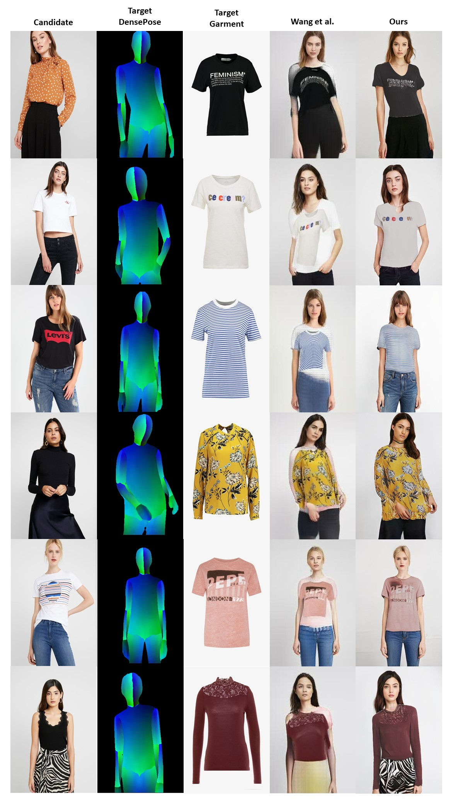

<div id="top"></div>

<h3> StyleVTON: A Multi-Pose Virtual Try-On with Identity and Clothing Detail Preservation</h3>

<p>
This repository has the official code for 'StyleVTON: A Multi-Pose Virtual Try-On with Identity and Clothing Detail Preservation'. 
We have included the pre-trained checkpoint, dataset and results.   
</p>

> **Abstract:** *Virtual try-on models have been developed using deep learning techniques to transfer clothing product images onto a candidate. While previous research has primarily focused on enhancing the realism of the garment transfer, such as improving texture quality and preserving details, there is untapped potential to further improve the shopping experience for consumers. The present study outlines the development of an innovative virtual try-on model, namely StyleVTON, to enhance consumers' shopping experiences. Our method synthesises a try-on image while also allowing for changes in pose. To achieve this, StyleVTON first predicts the segmentation of the target pose based on the target garment. Next, the segmentation layout guides the warping process of the target garment. And finally, the pose of the candidate is transferred to the desired posture. Our experiments demonstrate that StyleVTON can generate high-quality images of candidates wearing the desired clothes in a desired pose, offering a promising solution for enhancing the virtual try-on experience. Our findings reveal that StyleVTON outperforms other comparable methods, particularly in preserving the facial identity of the candidate and synthesising high-quality garments.*

## Installation

Clone this repository:

```
git clone https://github.com/1702609/multi_pose_vton
cd ./multi_pose_vton/
```

Install PyTorch and other dependencies:

```
pip install torch==1.10.2+cu113 torchvision==0.11.3+cu113 torchaudio===0.10.2+cu113 -f https://download.pytorch.org/whl/cu113/torch_stable.html
pip install -r requirements.txt
```

## Dataset

Download the VITON-HD dataset by clicking on this link: 
[[VITON-HD dataset]](https://www.dropbox.com/s/8nl54f3uzf5p6zi/SVTON_DATASET.zip?dl=0)
 Extract the files and place them in the ```viton_hd_dataset``` directory

If you wish to train the pose transfer module then you must download the DeepFashion dataset, please refer to:
[[DeepFashion dataset]](https://github.com/BadourAlBahar/pose-with-style/blob/main/DATASET.md)
## Pre-trained Checkpoint

Download the checkpoint by clicking on this link: 
[[Pre-trained checkpoints]](https://www.dropbox.com/s/8q7mg1a7c8ci2ec/styleVTON_checkpoint.zip?dl=0) 
Extract the files and place them in the ```checkpoint``` directory

## Inference
To run the inference of our model, execute ```python run_inference.py```

To create your own custom pair of candidate image and target clothing, follow these steps:
- Create a text file within the ```viton_hd_dataset``` directory.
- In the text file, add the name of the candidate image in the first column and the name of the garment in the second column.
- Then run: ```python run_inference.py --datapairs custom.txt```

The results will be saved in the ```result``` directory. 

## Train
To train, run ```python -m torch.distributed.launch --nproc_per_node=<number_of_gpus> train_[segment/warping/pose_transfer]``` and the checkpoint will be saved periodically in the ```checkpoint_[segment/warping/pose_transfer]``` directory.

<!-- Results -->
## Results
